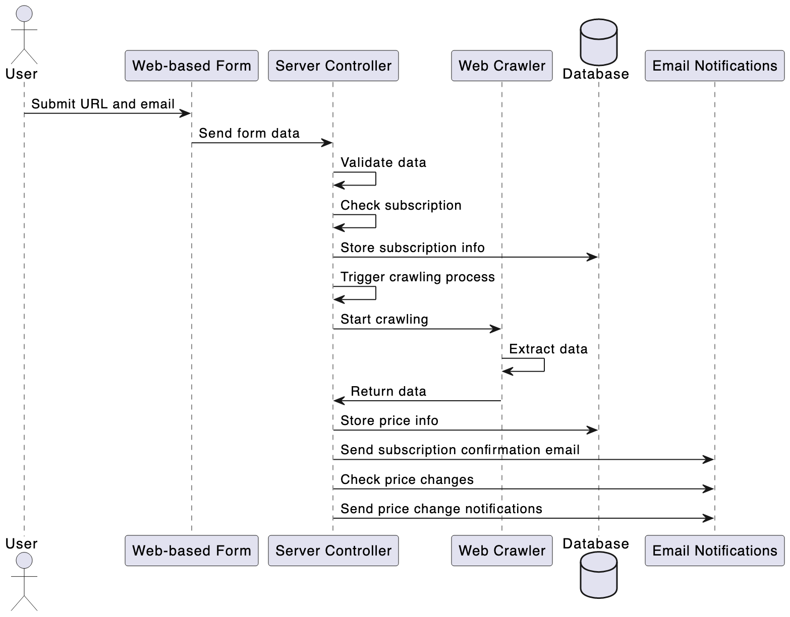

Web Application Workflow
User Interaction:

    Users submit a URL (from "olx.ua") and their email via a web form.

Server Processing:

    Validates the submitted data.
    Checks for existing subscriptions and creates a new one if necessary.
    Triggers the web crawler for the submitted URL.

Web Crawling:

    Scrapes data such as product title and price from the URL.

Database Management:

    Stores subscription details in the subscriptions table.
    Records scraped data, particularly prices, ensuring unique URL entries.

Email Notifications:

    Sends an initial confirmation email upon successful subscription.
    Notifies subscribers of price changes, based on periodic checks of subscribed URLs.
Diagram:

